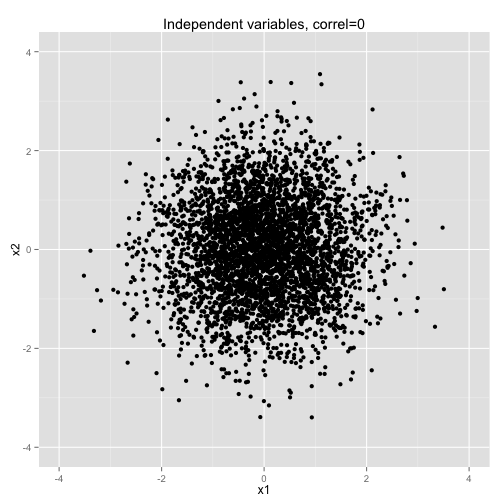
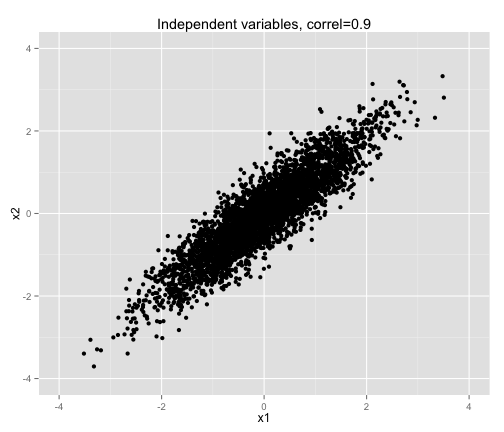
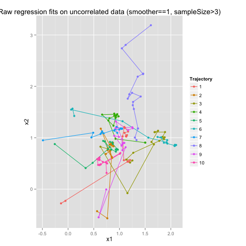
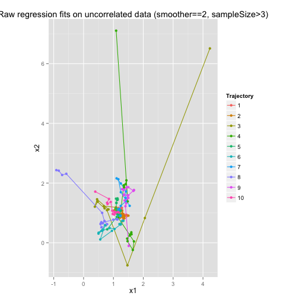
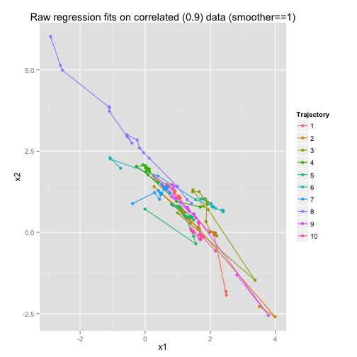
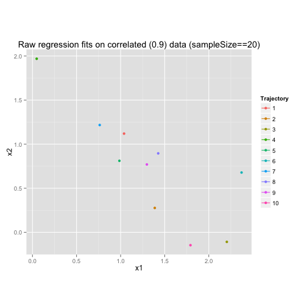

How fit trajectories illuminate shaky science
========================================================

Many science studies report results on highly correlated data.  For example, a study of high school drop-outs might find that low student science scores are a strong predictor while math scores are not.

Be suspcicious of such studies-- many of them are shaky science.  Many of them accidentally use insufficent sample sizes, given the data and fitting method.  But you don't need to be a sample size expert to understand why it's shaky.  Looking at the fit trajectory-- how the fitted values change with sample size, can make it clear.  This is a short intro to the technique.


```r
library(ggplot2)
```


Now set some basic parameters for the data.

```r
maxSampleSize <- 50
maxNumTrajectories <- 10
maxNumSmoothersPerTrajectory <- 8
```

As a consequence of these settings, here is how much data we have to generate.

```r
n <- maxSampleSize * maxNumTrajectories * maxNumSmoothersPerTrajectory
```

Now let's generate data in a repeatable way.  Notice we set a seed so the same random sequence is generated every time it's run. We will use N(0,1) initially and transform the data later to different amounts of correlation and noise.

```r
set.seed(1233)
X_base <- matrix(rnorm(2 * n), n, 2)
colnames(X_base) <- c("x1", "x2")
Y_noise <- c(rnorm(n))
# colnames(Y_noise) <- c('y_noise')
ggplot(as.data.frame(X_base), aes(x1, x2)) + geom_point() + labs(title = "Independent variables, correl=0") + 
    xlim(-4, 4) + ylim(-4, 4)
```

```
## Warning: Removed 2 rows containing missing values (geom_point).
```

 

ggplot reports missing values-- these are values outside of xlim and ylim.

Here is the matrix governing the relationship of the independent variables

```r
sigma <- matrix(c(1, 0.9, 0.9, 1), 2, 2)
```


FUNCTIONS

```r
transform <- function(sigma, X) {
    M <- chol(sigma)
    newX <- X %*% M
    colnames(newX) <- colnames(X)
    return(newX)
}
```


Now use the transform function to compare data.  Plot of original data, plot of transformed data.  (You should see the same thing I did because we used the same seed to the initial rnorm.)

```r
X_correl_9 <- transform(sigma, X_base)
ggplot(as.data.frame(X_correl_9), aes(x1, x2)) + geom_point() + labs(title = "Independent variables, correl=0.9") + 
    xlim(-4, 4) + ylim(-4, 4)
```

```
## Warning: Removed 1 rows containing missing values (geom_point).
```

 


Now do settings to generate y data.

```r
b0 <- 0
b1 <- 1
b2 <- 1
```


FUNCTION

```r
gen2dLinearY <- function(X, noise, b0 = 0, b1 = 1, b2 = 1) {
    new <- cbind(b0 + b1 * X[, 1] + b2 * X[, 2] + Y_noise, X[, 1], X[, 2])
    colnames(new) <- c("y", colnames(X))  # TODO: remove hard coding
    return(new)
}
```


Then calculate Y and prepend to the X matrix.

```r
Xmatrix <- gen2dLinearY(X_base, Y_noise)
```


FUNCTIONS

```r
calcStartRow <- function(trajIndex, smootherIndex, numSmoothersPerTrajectory, 
    maxSampleSize) {
    (trajIndex - 1) * numSmoothersPerTrajectory * maxSampleSize + (smootherIndex - 
        1) * maxSampleSize + 1
}
fitRegDataFrame <- function(fittingData, formula, numTrajectories, numSmoothersPerTrajectory, 
    minSampleSize, maxSampleSize, verbose = FALSE) {
    regData <- data.frame()
    for (trajIndex in 1:numTrajectories) {
        for (smootherIndex in 1:numSmoothersPerTrajectory) {
            startRow <- calcStartRow(trajIndex, smootherIndex, numSmoothersPerTrajectory, 
                maxSampleSize)
            for (sampleDataIndex in minSampleSize:maxSampleSize) {
                if (verbose) {
                  cat("using rows ", startRow, " to ", (startRow + sampleDataIndex - 
                    1), "\n")
                }
                reg <- lm(formula, data = fittingData[startRow:(startRow + sampleDataIndex - 
                  1), ])
                regData <- rbind(regData, cbind(trajectoryIndex = trajIndex, 
                  smootherIndex = smootherIndex, sampleSize = sampleDataIndex, 
                  t(coef(reg))))
            }
        }
    }
    return(regData)
}
```


Now do some fits using the simplest linear model.

```r
fitFormula <- as.formula("y ~ x1 + x2")
myRegData <- fitRegDataFrame(as.data.frame(Xmatrix), fitFormula, maxNumTrajectories, 
    maxNumSmoothersPerTrajectory, 3, 20, verbose = FALSE)
```


Plot original fits.  (Pick an arbitrary smoother and plot just that one rather than averaging across smoothers.)


```r
# install.packages('ggplot2') # if never downloaded before
library(ggplot2)
#
myRegDataToPlot <- subset(myRegData, smootherIndex == 1)
ggplot(myRegDataToPlot, aes(x1, x2, color = as.factor(trajectoryIndex))) + geom_path() + 
    geom_point() + coord_fixed() + labs(color = "Trajectory") + labs(title = "Raw regression fits on uncorrelated data (smoother==1)")  #+xlim(-4,4)+ylim(-4,4)
```

 

```r
# TODO: Title = typeOfFit + ' on ' + dataDesc
```

Notice how very messy it is!  

The first fit with sample size 3 is especially bad.  Let's leave that one out and see how much is cleans things up.

```r
myRegDataToPlot <- subset(myRegData, smootherIndex == 1 & sampleSize > 3)
ggplot(myRegDataToPlot, aes(x1, x2, color = as.factor(trajectoryIndex))) + geom_path() + 
    geom_point() + coord_fixed() + labs(color = "Trajectory") + labs(title = "Raw regression fits on uncorrelated data (smoother==1, sampleSize>3)")  #+xlim(-4,4)+ylim(-4,4)
```

 

Still messy but less spread out.  Notice that the fit does not always head in the right direction.  Sometimes instead of going toward the true parameter value (1,1), it goes away from the it, as in trajectory 9.  (TODO: a close-up of trajectory 9 but we will need fixed scales-- same as in overall plot.  In fact, I should start with ONE fit trajectory and then show how plotting many gives a sense of the "force field," the pull coming from the shape of the data and the kind of fit.  Smoothers are motivated by wanting to see the force field.  In plotting one trajectory at a time, it would also be awesome to use the same color as in the master plot.) (TODO: I can probably do subset in the ggplot command rather than as a pre-process.)

Just for the sake of curiosity, here is another set of plots from smoother 2.  This is another sample from the data.  It has the same degree of "messiness."  Smoother 1 was not an atypical sample

```r
myRegDataToPlot <- subset(myRegData, smootherIndex == 2 & sampleSize > 3)
ggplot(myRegDataToPlot, aes(x1, x2, color = as.factor(trajectoryIndex))) + geom_path() + 
    geom_point() + coord_fixed() + labs(color = "Trajectory") + labs(title = "Raw regression fits on uncorrelated data (smoother==2, sampleSize>3)")  #+xlim(-4,4)+ylim(-4,4)
```

 


CORRELATED DATA
Now let's doe the plots on correlated data.  This will not be very enlightening for individual trajectories-- so this is where seeing the "force field" across multiple fits will prove useful.

```r
sigma <- matrix(c(1, 0.9, 0.9, 1), 2, 2)  # repeated as a reminder of how we got the data
X_correl_9 <- transform(sigma, X_base)  # repeated as a reminder of how we got the data
Xmatrix <- gen2dLinearY(X_correl_9, Y_noise)
fitFormula <- as.formula("y ~ x1 + x2")
myRegData <- fitRegDataFrame(as.data.frame(Xmatrix), fitFormula, maxNumTrajectories, 
    maxNumSmoothersPerTrajectory, 3, 20, verbose = FALSE)
myRegDataToPlot <- subset(myRegData, smootherIndex == 1 & sampleSize > 3)
ggplot(myRegDataToPlot, aes(x1, x2, color = as.factor(trajectoryIndex))) + geom_path() + 
    geom_point() + coord_fixed() + labs(color = "Trajectory") + labs(title = "Raw regression fits on correlated (0.9) data (smoother==1)")  #+xlim(-2,4)+ylim(-4,4)
```

 

The fit trajectories are still messy but clearly concentrated around a line diagonal to the right.  Fits quickly converge to this general area but then wander aimlessly along it.  The topography of the parameter space has ellpises with their major axis along the convergence line.  (See fungible weights article.  TODO: use ggplot to show ellipses.)

By the time of a sample size of 20, they still settle in a wide range of places.  Trajectory 3 settled near (x1,x2)= (2,0), meaning x1 is much stronger than x2.  Trajectory 4 settled near (x1,x2)=(0,2), meaning x2 is much stronger than x1. Which is right?  Well, on highly correlated data, x1 is nearly interchangeable with x2, so the weights between them can slosh around as long as they add up to roughly 2.  WE know we generated the data with (x1,x2)=(1,1).  But the high correlation means it's very hard to converge there.
(TODO: Save the regression objects so I can easily pull out p-values.)

```r
endingFit <- subset(myRegData, smootherIndex == 1 & sampleSize == 20)
ggplot(endingFit, aes(x1, x2, color = as.factor(trajectoryIndex))) + geom_path() + 
    geom_point() + coord_fixed() + labs(color = "Trajectory") + labs(title = "Raw regression fits on correlated (0.9) data (sampleSize==20)")
```

```
## geom_path: Each group consist of only one observation. Do you need to
## adjust the group aesthetic?
```

 


Notice the area they are converging to is perpendicular to the pattern of the correlated x data, which were roughly on the x1=x2 line.  This is not an accident.  Correlation is akin to the cosine of the angle.  No correlation has a cosine of 0, meaning orthogonal lines.  But we know x1 and x2 have a correlation of 0.9.  If we transformed our parameter space by bending x2 down toward x1 so that its cosine was __, then we would be representing the "true" parameter space. In this space, the fits would no longer be stretched out over a line-- they would seem to converge from all directions.  In other words the "fit field" would have all arrows pointing in toward (1,1). And the "fit topography" would be circles again rather than ellipses.  (TODO: Can ggplot show non-orthogonal axes??)

Application to drop-out rates

Back to the study of high school drop-out rates.  Student math scores and science scores are highly correlated.  So the fitted regression of drop-out rate on both scores can end up anywhere along the x2 = -x1 + intercept.  One sample's fit trajector might end with math scores a strong predictor while science scores are not.  Another sample might prefer science scores.  This may look like the studies are contradicting each other.  But they are just shaky science due to highly correlated data.

What is the alternative?  The best is to increase the sample size.  (TODO: Plot examples)  But there are less than 100 public high schools in Chicago, so you cannot get a really big sample of their drop-out rates.  

So another alternative is to use a model with a simpler fitting method.  It extracts less information from the data.  For this to be a good fit, the modeler must add their prior knowledge of the domain to make up for it.  A biased model can be really bad if it's not well-matched to the domain.  Some examples are:

1. The modeler already suspects that math score and science score are highly correlated.  So remove one of them.  For example, regress on just math score.  This will make the fit much more stable, meaning that re-running the study will produce similar results.  (TODO: Plot)

2. Use an equal-weight or unit-weight linear model.  That is, only estimate plus or minus 1 for each predictor.  (TODO: build code to do equal-weight fit.  Than fit it)

3. Other ideas?
