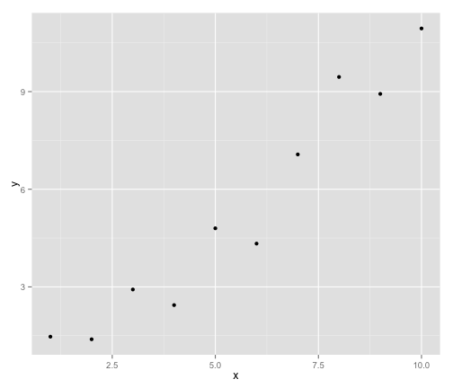

Jean's test
========================================================

I am going to demonstrate making stuff repeatable.  First just load required packages.


```r
library(ggplot2)
library(lattice)
```


Now let's generate data in a repeatable way.  Notice we set a seed.

```r
set.seed(1233)
x <- 1:10
y <- round(rnorm(10, x, 1), 2)
df <- data.frame(x, y)
df
```

```
##     x     y
## 1   1  1.47
## 2   2  1.39
## 3   3  2.92
## 4   4  2.44
## 5   5  4.80
## 6   6  4.33
## 7   7  7.07
## 8   8  9.45
## 9   9  8.93
## 10 10 10.94
```


Now let's plot the data.  You should see the same thing I did because we used the same seed.

```r
qplot(x, y, data = df)
```

 


